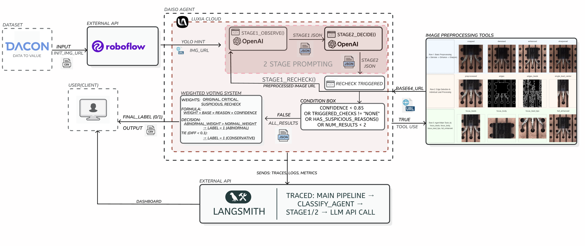

# dAIso Agent

**Defect Analysis & Inspection System with OpenAI**


반도체 부품 불량 검출을 위한 Two-Stage Prompting 기반 AI Agent

[](https://huggingface.co/spaces/promise42da/dAIso)
[](LICENSE)

---

## Demo

> **[Live Demo on Hugging Face Spaces](https://huggingface.co/spaces/promise42da/dAIso)**

실시간으로 분석 결과를 확인하고 AI Assistant와 대화할 수 있는 웹 데모입니다.



---

## 프로젝트 개요

dAIso Agent는 반도체 부품(TO-220 패키지) 이미지를 분석하여 불량 여부를 자동으로 판정하는 AI 에이전트입니다.

### 핵심 기능

- **YOLO 기반 컴포넌트 탐지**: Roboflow를 통한 리드, 홀, 본체 위치 검출
- **Two-Stage GPT-4o 분석**: 관찰(Stage 1) → 판정(Stage 2) 구조
- **조건부 재검증**: 신뢰도 기반 자동 Recheck 시스템
- **가중치 투표**: 다중 결과 기반 최종 판정

---

## 시스템 아키텍처

### Pipeline Overview

```
┌─────────────────────┐
│   Image Input       │
└──────────┬──────────┘
           │
           ▼
┌─────────────────────┐
│  Stage 0: YOLO      │  → 컴포넌트 탐지 (holes, leads, body)
│  (Roboflow API)     │  → Bounding Box + Confidence
└──────────┬──────────┘
           │
           ▼
┌─────────────────────┐
│  Stage 1: GPT-4o    │  → 이미지 관찰
│  (Observation)      │  → 구조화된 JSON 출력
└──────────┬──────────┘
           │
           ▼
┌─────────────────────┐
│  Stage 2: GPT-4o    │  → 불량 판정
│  (Decision)         │  → 라벨 + 신뢰도 + 근거
└──────────┬──────────┘
           │
           ▼
┌─────────────────────┐
│  Conditional        │  → Confidence < 85%?
│  Recheck            │  → 4가지 전처리 도구 활용
└──────────┬──────────┘
           │
           ▼
┌─────────────────────┐
│  Weighted Voting    │  → 최종 분류
│  System             │  → Normal(0) / Abnormal(1)
└─────────────────────┘
```

### Two-Stage Prompting

| Stage | 역할 | 입력 | 출력 |
|-------|------|------|------|
| **Stage 1** | 이미지 관찰 | 이미지 + YOLO 힌트 | 구조화된 관찰 JSON |
| **Stage 2** | 불량 판정 | 관찰 JSON | 라벨, 신뢰도, 근거 |

### 조건부 Recheck 트리거

```
CONFIDENCE < 0.85
OR TRIGGERED_CHECKS != "NONE"
OR HAS_SUSPICIOUS_REASONS()
OR NUM_RESULTS < 2
```

### 가중치 투표 시스템

| 결과 유형 | 가중치 |
|-----------|--------|
| 원본 판정 | 1.5x |
| Critical 근거 | 2.0x |
| Suspicious 근거 | 1.2x |
| 일반 Recheck | 1.0x |

---

## 이미지 전처리 도구

4가지 전처리 도구로 다양한 관점에서 이미지 분석:


| 도구 | 기능 | Focus |
|------|------|-------|
| `preprocess_focus_leads` | 리드 영역 강조 | 리드 형태, 휨, 간격 |
| `preprocess_focus_body` | 본체 영역 강조 | 본체 정렬, 위치 |
| `preprocess_focus_lead_tips` | 리드 끝단 강조 | 홀 도달 여부 |
| `preprocess_full_enhanced` | 전체 이미지 향상 | 종합 분석 |

---

## 결함 분류 체계

### Critical Reasons (확실한 불량)

- `bent_lead`, `missing_lead`, `broken`, `short_circuit`, `lifted_lead`

### Suspicious Reasons (추가 검증 필요)

- `blob_like`, `short_like`, `asymmetric`, `overlap`, `surface_mark`

### Defect Scoring

| Category | Defects | Score |
|----------|---------|-------|
| **Critical** | missed_hole, floating_lead, crossed/tangled | Auto-fail |
| **High** | severe_tilt, blob_shape, deformation | +3~4 |
| **Medium** | asymmetry, minor_tilt | +2 |

**분류 기준**: Score ≥ 3 → Abnormal(1), Score < 3 → Normal(0)

---

## 기술 스택

| 분류 | 기술 |
|------|------|
| **LLM** | GPT-4o (via Luxia Cloud Bridge API) |
| **Object Detection** | Roboflow Workflow API |
| **Tracing** | LangSmith |
| **Image Processing** | OpenCV, Pillow |
| **Framework** | Python, Pandas |
| **Demo UI** | Gradio (Hugging Face Spaces) |

---

## 프로젝트 구조

```
hyu-hyundai-ngv-ai-agent-hackathon/
├── src/
│   ├── agent/
│   │   ├── agent_v10.py              # 최신 에이전트 (V10)
│   │   ├── agent_v6.py ~ agent_v9.py # 버전별 에이전트
│   │   └── agent_with_langsmith_*.py # LangSmith 버전들
│   ├── preprocessing/
│   │   └── image_preprocessing_tools.py
│   └── labeling/
│       ├── auto_label.py             # 자동 라벨링
│       ├── label_editor.py           # 라벨 편집기
│       └── roboflow_label.py         # Roboflow 라벨링
├── dAIso/                            # Hugging Face Demo
│   ├── app.py                        # Gradio 앱
│   ├── requirements.txt
│   └── data/
│       ├── dummy_results.json        # 데모 데이터
│       └── dev_images/               # 샘플 이미지
├── data/
│   ├── dev.csv                       # 개발 데이터셋
│   └── dev_images/                   # 개발 이미지
├── assets/
│   ├── pipeline_architecture.png
│   └── preprocessing_tools.png
├── docs/
│   └── luxia_api_reference.md
├── requirements.txt
└── README.md
```

---

## 실행 방법

### 1. 환경 설정

```bash
# 가상환경 생성 및 활성화
python -m venv venv
source venv/bin/activate  # Windows: venv\Scripts\activate

# 의존성 설치
pip install -r requirements.txt
```

### 2. 환경 변수 설정

`.env` 파일 생성:

```env
LUXIA_API_KEY=your_luxia_api_key
LANGCHAIN_TRACING_V2=true
LANGCHAIN_API_KEY=your_langsmith_api_key
LANGCHAIN_PROJECT=semiconductor-defect-detection
```

### 3. 에이전트 실행

```bash
python src/agent/agent_v10.py
```

### 4. 로컬 데모 실행

```bash
cd dAIso
pip install -r requirements.txt
python app.py
```

---

## 결과

실행 후 `submission.csv`에 결과가 저장됩니다:

```csv
id,label
DEV_000,0
DEV_001,1
DEV_002,0
...
```

---

## 팀 정보

| 역할 | 이름 | GitHub |
|------|------|--------|
| 팀원 | 임동현 | [@Happ11quokka](https://github.com/Happ11quokka) |
| 팀원 | 서문경 | [@Munkyeong-Suh](https://github.com/Munkyeong-Suh) |

---

## 참고 문헌

### Chain-of-Thought Prompting (Two-Stage Reasoning)

| 논문 | 저자 | 학회/연도 | 핵심 내용 |
|------|------|-----------|-----------|
| [Chain-of-Thought Prompting Elicits Reasoning in Large Language Models](https://arxiv.org/abs/2201.11903) | Wei et al. | NeurIPS 2022 | 중간 추론 단계를 생성하면 LLM의 복잡한 추론 능력이 향상됨을 증명 |
| [Multimodal Chain-of-Thought Reasoning in Language Models](https://arxiv.org/abs/2302.00923) | Zhang et al. | ACL 2023 | Two-Stage Framework: 1단계에서 rationale 생성, 2단계에서 답변 추론 |

### Self-Consistency & Voting (가중치 투표 시스템)

| 논문 | 저자 | 학회/연도 | 핵심 내용 |
|------|------|-----------|-----------|
| [Self-Consistency Improves Chain of Thought Reasoning in Language Models](https://arxiv.org/abs/2203.11171) | Wang et al. | ICLR 2023 | 다양한 추론 경로를 샘플링한 후 다수결 투표로 최종 답변 선택 |
| [Mirror-Consistency: Harnessing Inconsistency in Majority Voting](https://aclanthology.org/2024.findings-emnlp.135/) | - | EMNLP 2024 | 소수 의견도 정보를 포함할 수 있음을 고려한 개선된 투표 방식 |

### Confidence Calibration (신뢰도 기반 재검증)

| 논문 | 저자 | 학회/연도 | 핵심 내용 |
|------|------|-----------|-----------|
| [A Survey of Confidence Estimation and Calibration in Large Language Models](https://arxiv.org/abs/2311.08298) | Geng et al. | TMLR 2024 | LLM의 신뢰도 추정 및 calibration 방법론 종합 서베이 |
| [Can LLMs Express Their Uncertainty?](https://arxiv.org/abs/2306.13063) | Xiong et al. | ICLR 2024 | LLM이 자신의 불확실성을 표현할 수 있는지 실증 평가 |

### Vision-Language Models for Defect Detection

| 논문 | 저자 | 학회/연도 | 핵심 내용 |
|------|------|-----------|-----------|
| [The Dawn of LMMs: Preliminary Explorations with GPT-4V(ision)](https://arxiv.org/abs/2309.17421) | Yang et al. | arXiv 2023 | GPT-4V의 시각적 이해 능력 종합 평가 |
| [LogicQA: Logical Anomaly Detection with Vision Language Models](https://aclanthology.org/2025.acl-industry.29/) | - | ACL 2025 Industry | VLM을 활용한 논리적 이상 탐지 |

---

## 라이선스

MIT License

---

## 참고 자료

- [DACON 현대자동차그룹 x AI 해커톤](https://dacon.io/)
- [LangSmith Documentation](https://docs.smith.langchain.com/)
- [Luxia Cloud API](https://luxia.cloud/)
- [Roboflow](https://roboflow.com/)
