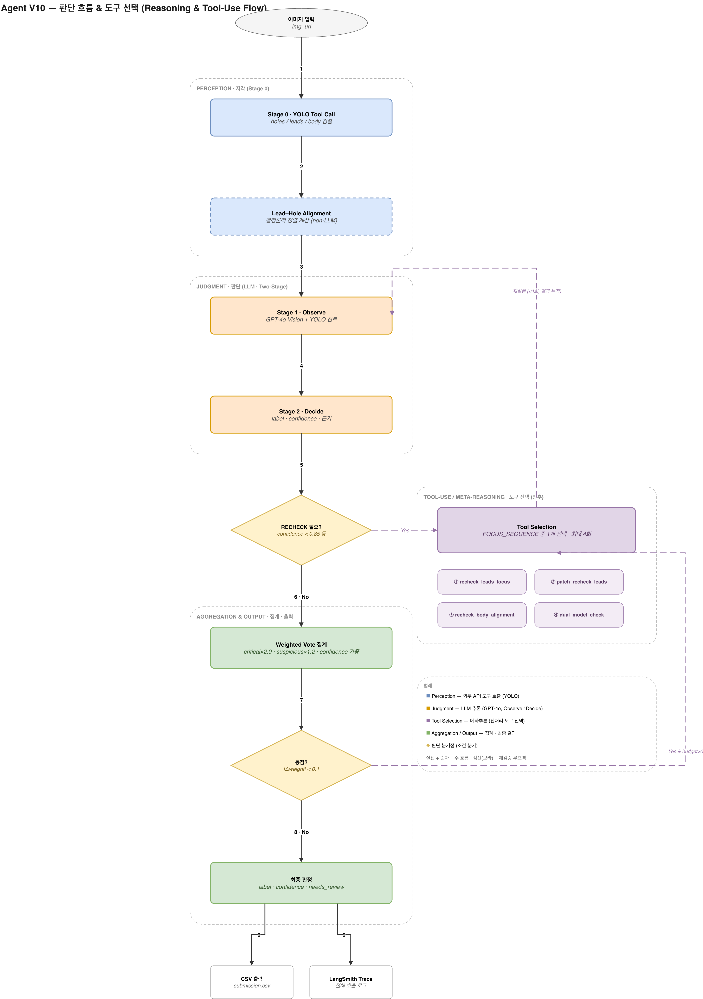
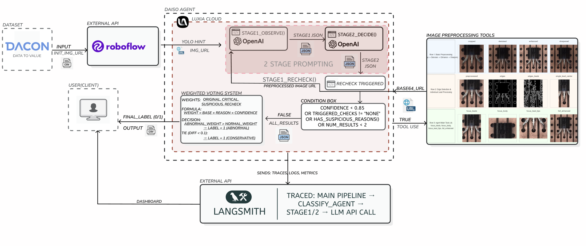
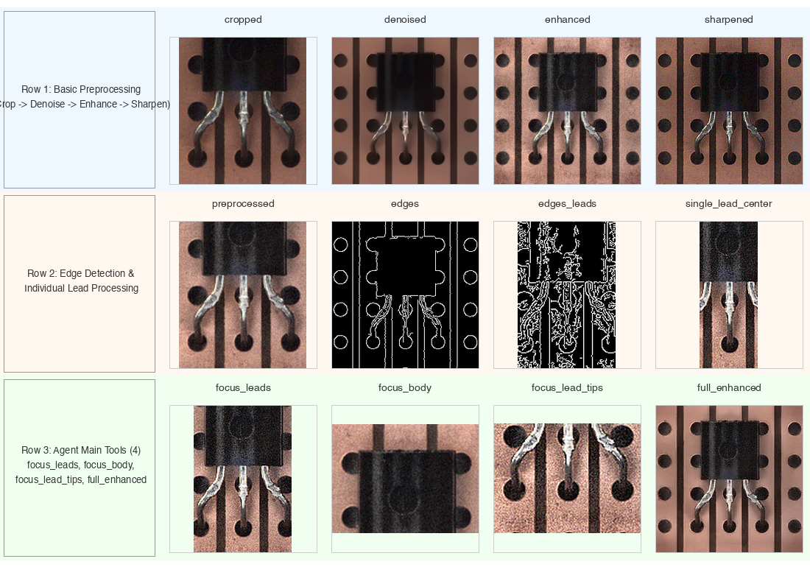

# dAIso Agent

**Defect Analysis & Inspection System with OpenAI**


멀티모달 LLM(GPT-4o)과 YOLO 객체 검출을 결합해, 반도체 부품(TO-220 패키지) 조립 이미지를 스스로 관찰(Observe) → 판단(Decide) → 필요시 도구를 골라 재검증(Recheck)하는 **2단계 판단 + 조건부 툴 사용 에이전트**입니다.

> [!IMPORTANT]
> **DACON 현대자동차그룹 x AI 해커톤 — 최우수상 수상**

[](https://dacon.io/)
[](https://huggingface.co/spaces/promise42da/dAIso)
[](LICENSE)


---

## Overview

dAIso Agent는 반도체 부품(TO-220 패키지) 이미지를 분석하여 불량 여부를 자동 판정하는 AI **에이전트**입니다. 단순히 이미지를 한 번 분류하는 모델이 아니라, 아래와 같은 **판단 흐름(reasoning loop)**을 가집니다.

1. **지각(Perception)**: YOLO(Roboflow)로 부품/리드/홀을 먼저 검출해 힌트를 만든다.
2. **판단(Judgment)**: GPT-4o가 이미지를 직접 보고 관찰(Stage 1) → 점수 기반 판정(Stage 2)을 수행한다.
3. **자기 검증(Tool-Use / Meta-reasoning)**: 판정 확신도가 낮거나 의심스러운 근거가 있으면, 에이전트가 4종 이미지 전처리 도구 중 **어떤 도구를 쓸지 스스로 선택**해 최대 4회까지 재검증한다.
4. **집계(Aggregation)**: 원본 판정과 재검증 결과들을 가중치 투표로 종합해 최종 정상/불량을 결정한다.

YOLO 기반 컴포넌트 탐지와 GPT-4o Two-Stage Prompting을 결합하고, 신뢰도 기반 조건부 Recheck 및 가중치 투표로 최종 판정의 정확도를 높이는 것이 핵심 아이디어입니다.

---

## Demo

> **[Live Demo on Hugging Face Spaces](https://huggingface.co/spaces/promise42da/dAIso)** — Dashboard / Inspection Results / Visualizations / AI Assistant(챗봇) 4개 탭으로 분석 결과를 탐색할 수 있습니다.

> [!NOTE]
> Live Demo는 해커톤 심사 당시 발급받은 유료 LLM 브릿지 키(Luxia Cloud) 없이도 누구나 즉시 열어볼 수 있도록, dev 세트 20장에 대한 **사전 계산된 대표 결과 샘플**(`dAIso/data/dummy_results.json`)로 UI를 구동합니다. 정상/불량 라벨 자체는 실제 제출 이력(`submission.csv`)과 동일하지만, confidence·처리시간 등 세부 수치는 데모 연출용 값이 섞여 있습니다 — 아래 [Key Results](#key-results)의 수치만 실측/재현 가능한 값입니다.

---

## Architecture

### 에이전트 판단 흐름 (Reasoning & Tool-Use Flow)

이 프로젝트의 핵심은 "한 번의 LLM 호출로 끝나지 않는" 에이전트 구조입니다. 아래 다이어그램은 지각(Stage 0) → 판단(Stage 1·2) → 에이전트가 **스스로 어떤 전처리 도구를 쓸지 선택**하는 메타추론 루프 → 가중치 집계까지의 전체 판단 흐름을 보여줍니다.



- **분기점 1 (RECHECK 필요?)**: `confidence < 0.85` / `triggered_checks ≠ none` / 의심 근거 존재 / 최소 투표 수 미달 중 하나라도 해당하면 에이전트가 재검증을 시작합니다.
- **도구 선택(Tool Selection)**: 재검증이 필요하면 `FOCUS_SEQUENCE` 순서로 4개 전처리 도구 중 하나를 선택해 실행하고, 그 결과 이미지로 Stage 1·2를 다시 수행합니다 (최대 4회, `MAX_RECHECK_COUNT`).
- **분기점 2 (동점?)**: 가중치 투표 결과가 동점(`|Δweight| < 0.1`)이면 남은 재검증 예산이 있는 한 도구 선택 루프로 다시 진입합니다.
- 모든 주요 함수는 `@traceable` 데코레이터로 LangSmith에 자동 기록되어, 어떤 순서로 어떤 도구가 호출됐는지 사후에 추적할 수 있습니다.

### 시스템/데이터 흐름 (System & Data Flow)

아래는 위 판단 흐름을 실제 서비스 구성요소(DACON 데이터셋 → Roboflow → Luxia Cloud(GPT-4o) → LangSmith → 사용자) 관점에서 본 다이어그램입니다.



### Two-Stage Prompting

| Stage | 역할 | 입력 | 출력 |
|-------|------|------|------|
| **Stage 0** | 컴포넌트 탐지 (YOLO) | 이미지 | Bounding Box + Confidence |
| **Stage 1** | 이미지 관찰 (GPT-4o) | 이미지 + YOLO 힌트 | 구조화된 관찰 JSON |
| **Stage 2** | 불량 판정 (GPT-4o) | 관찰 JSON | 라벨, 신뢰도, 근거 |

### 조건부 Recheck

신뢰도가 85% 미만이거나, 의심 근거가 존재하거나, 결과 수가 부족한 경우 4가지 전처리 도구를 활용하여 자동으로 재검증을 수행합니다.

### 가중치 투표 시스템

| 결과 유형 | 가중치 |
|-----------|--------|
| 원본 판정 | 1.5x |
| Critical 근거 | 2.0x |
| Suspicious 근거 | 1.2x |
| 일반 Recheck | 1.0x |

### 이미지 전처리 도구 (에이전트의 툴셋)

에이전트가 재검증 시 스스로 선택하는 4가지 전처리 도구입니다. 서로 다른 관점(리드 형태, 본체 정렬, 리드 끝단, 종합)에서 이미지를 강조해 GPT-4o의 관찰 정확도를 높입니다.



| 도구 | 기능 | Focus | 매핑되는 `triggered_checks` 값 |
|------|------|-------|------|
| `preprocess_focus_leads` | 리드 영역 강조 | 리드 형태, 휨, 간격 | `recheck_leads_focus` |
| `preprocess_focus_lead_tips` | 리드 끝단 강조 | 홀 도달 여부 | `patch_recheck_leads` |
| `preprocess_focus_body` | 본체 영역 강조 | 본체 정렬, 위치 | `recheck_body_alignment` |
| `preprocess_full_enhanced` | 전체 이미지 향상 | 종합 분석 | `dual_model_check` |

---

## My Role

**임동현** — AI Pipeline, Demo, Data (2인 팀)

| 영역 | 기여 내용 |
|------|-----------|
| AI Pipeline | Two-Stage Prompting 설계, 조건부 Recheck 로직, 가중치 투표 시스템 |
| Object Detection | Roboflow 데이터셋 구축, YOLO Workflow 설계 |
| 이미지 전처리 | OpenCV 기반 4종 전처리 도구 개발 |
| Demo | Gradio 웹 데모 개발 + Hugging Face Spaces 배포 |
| Data | 자동 라벨링 파이프라인, 라벨 편집기 개발 |
| Tracing | LangSmith 연동을 통한 프롬프트 추적 및 디버깅 |

---

## Key Results

> [!NOTE]
> **측정 방법론 (정직성 표기)**: 해커톤 당시 GPT-4o 호출에 사용한 `LUXIA_API_KEY`(주최측 발급, Luxia Cloud Bridge 전용)는 대회 종료 후 회수되어 이 포트폴리오 정리 시점에는 재현할 수 없습니다. 아래 지표 중 **① DACON 공식 결과는 대회 심사 기준 실제 성과**이고, **② Stage 0(YOLO/Roboflow) 실측 테스트는 이번 정리 과정에서 실제 API를 재호출**해 얻은 값이며, **③ 판단 로직(가중치 투표·정렬 분석) 테스트는 GPT-4o 없이 결정론적 코드만 검증한 유닛 테스트**입니다. Stage 1·2(GPT-4o) 자체의 재현 실측은 유료 키 부재로 수행하지 못했습니다 — 이 사실을 숨기지 않고 명시합니다.

### ① 대회 공식 결과 (실측)

- **DACON 현대자동차그룹 x AI 해커톤 최우수상 수상** — 100장 규모 비공개 테스트셋에 대한 대회 주최측 채점 결과.

### ② Stage 0 (YOLO/Roboflow) 실측 스모크 테스트

`data/dev.csv`의 실제 이미지 20장에 대해 `src/agent/agent_v10.py`의 `stage0_yolo_detect()` / `analyze_lead_hole_alignment()`를 **그대로 import**해 Roboflow Workflow API를 재호출한 결과입니다 (재현 스크립트: [`eval/test_stage0_smoke.py`](eval/test_stage0_smoke.py), 원본 로그: [`eval/results/stage0_smoke_test_results.json`](eval/results/stage0_smoke_test_results.json)).

| 지표 | 값 |
|------|-----|
| API 호출 성공률 | **20/20 (100%)** |
| 평균 응답 시간 | **2.36초/장** (docs/V10_PIPELINE.md의 추정치 ~0.5초보다 높음 — 실측으로 캘리브레이션) |
| Body 검출률 | 19/20 (95%) |
| 평균 검출 hole 후보 수 | 22.1개/장 |
| 원시 정렬 휴리스틱이 "이상 있음"으로 플래그한 이미지 | **19/20 (95%)** |

**발견한 점**: YOLO 바운딩박스 거리만으로 계산하는 `analyze_lead_hole_alignment()` 휴리스틱은 20장 중 19장에서 `missed_hole` 류 이슈를 플래그했습니다. 하지만 실제 제출 이력(`submission.csv`)상 정상 판정은 20장 중 16장이었습니다. 즉 **순수 기하학적 휴리스틱만으로는 오탐(false positive)이 매우 많다**는 것이 실측으로 확인되며, 이는 이 프로젝트가 YOLO 힌트를 그대로 쓰지 않고 "GPT-4o가 이미지를 직접 보고 다시 확인"하는 2단계 구조를 택한 설계 판단이 타당했음을 뒷받침합니다.

### ③ 판단 로직 유닛 테스트 (결정론적 코드, LLM 미사용)

`vote_decision()`(가중치 투표)과 `analyze_lead_hole_alignment()`(정렬 분석)를 `docs/V10_PIPELINE.md`에 문서화된 예시·엣지 케이스로 검증했습니다 (재현 스크립트: [`eval/test_decision_logic.py`](eval/test_decision_logic.py)).

| 테스트 | 결과 |
|--------|------|
| 문서의 "투표 예시"와 동일 입력 → `abnormal`, confidence 0.81 | PASS |
| 만장일치 normal, critical/suspicious 근거 없음 → `normal` | PASS |
| 근소한 가중치 차이 → `is_tie` 정상 감지 | PASS |
| 합성 YOLO 출력(완전 정렬) → `alignment_issues=[]` | PASS |

테스트 중 발견한 세부 사항: 정확히 동점인 경우의 최종 라벨 선택은 `vote_decision()` 내부에서 부동소수점 연산 순서에 따라 갈릴 수 있습니다. 문서에 기술된 "동점 시 보수적으로 abnormal 처리"는 `vote_decision()` 자체가 아니라 한 단계 위 `classify_agent()`의 재검증 반복 로직(`while is_tie: ...`, agent_v10.py L957-978)에서 보장됩니다 — 실제 코드를 실행해보지 않았다면 놓쳤을 구현 디테일입니다.

---

## Tech Stack Rationale

| 분류 | 기술 | 선택 이유 |
|------|------|-----------|
| **LLM** | GPT-4o (via Luxia Cloud Bridge API) | 멀티모달(이미지+텍스트) 추론이 필요했고, 해커톤에서 주최측이 Luxia Cloud Bridge를 통해 GPT-4o 엔드포인트를 표준으로 제공 |
| **Object Detection** | Roboflow Workflow API | 자체 YOLO 모델을 처음부터 학습할 시간이 부족한 해커톤 환경에서, 라벨링 → 학습 → 서빙을 하나의 워크플로로 빠르게 구축 가능 |
| **판단 구조** | Two-Stage Prompting (관찰 → 판단 분리) | 한 번에 "보고 바로 판정"하게 하면 근거 없는 판단이 섞이기 쉬워, Stage 1에서 사실 관찰만 강제하고 Stage 2에서 그 관찰만 근거로 점수화하도록 역할을 분리 |
| **재검증 전략** | 조건부 Recheck + 가중치 투표 (단순 다수결 대신) | 이미지 화질·힌트 신뢰도가 균일하지 않아, 원본 판정과 critical 근거에 더 큰 가중치를 주는 것이 단순 다수결보다 오탐/미탐 균형에 유리했음 |
| **Tracing** | LangSmith | 멀티스텝 에이전트(최대 4회 재검증)의 호출 순서·프롬프트·응답을 사후 디버깅하려면 각 단계가 개별적으로 추적되어야 함 |
| **Image Processing** | OpenCV, Pillow | 크롭/대비 강조/샤픈 등 4종 전처리 도구를 가볍고 의존성 적게 구현 |
| **Framework** | Python, Pandas | 대회 제공 데이터가 CSV 기반이라 데이터 처리 파이프라인과의 궁합 |
| **Demo UI** | Gradio (Hugging Face Spaces) | 무료로 즉시 공유 가능한 웹 데모가 필요했고, Python 코드만으로 대시보드/챗봇 UI 구성 가능 |

---

## 프로젝트 구조

```
dAIso-Agent/
├── src/
│   ├── agent/
│   │   └── agent_v10.py              # 최종 에이전트
│   ├── preprocessing/
│   │   └── image_preprocessing_tools.py
│   └── labeling/
│       ├── auto_label.py             # 자동 라벨링
│       ├── label_editor.py           # 라벨 편집기
│       └── roboflow_label.py         # Roboflow 라벨링
├── eval/                              # 실측 평가/테스트 (포트폴리오 정리 시 추가)
│   ├── test_stage0_smoke.py          # Roboflow 실 API 스모크 테스트
│   ├── test_decision_logic.py        # 판단 로직 유닛 테스트
│   └── results/
│       └── stage0_smoke_test_results.json
├── dAIso/                            # Hugging Face Demo
│   ├── app.py                        # Gradio 앱
│   ├── requirements.txt
│   └── data/
│       ├── dummy_results.json
│       └── dev_images/
├── data/
│   ├── dev.csv
│   └── dev_images/
├── assets/
│   ├── agent_reasoning_flow.png      # 에이전트 판단 흐름 다이어그램 (신규)
│   ├── pipeline_architecture.png
│   └── preprocessing_tools.png
├── docs/
│   ├── V10_PIPELINE.md               # V10 파이프라인 상세 문서
│   └── luxia_api_reference.md
├── requirements.txt
└── README.md
```

---

## Getting Started

```bash
# 환경 설정
python -m venv venv
source venv/bin/activate  # Windows: venv\Scripts\activate
pip install -r requirements.txt
```

`.env` 파일 생성:

```env
LUXIA_API_KEY=your_luxia_api_key
LANGCHAIN_TRACING_V2=true
LANGCHAIN_API_KEY=your_langsmith_api_key
LANGCHAIN_PROJECT=semiconductor-defect-detection
```

```bash
# 에이전트 실행
python src/agent/agent_v10.py

# 로컬 데모 실행
cd dAIso && pip install -r requirements.txt && python app.py
```

### 평가/테스트 재현

```bash
# Stage 0 (YOLO/Roboflow) 실 API 스모크 테스트 — LUXIA_API_KEY 불필요
pip install inference-sdk pandas
python eval/test_stage0_smoke.py

# 판단 로직(가중치 투표·정렬 분석) 유닛 테스트 — API 키 불필요
python eval/test_decision_logic.py
```

---

## Links

### 팀 정보

| 이름 | 역할 | GitHub |
|------|------|--------|
| **임동현** | AI Pipeline, Demo, Data | [@Happ11quokka](https://github.com/Happ11quokka) |
| 서문경 | Data Analysis | [@Munkyeong-Suh](https://github.com/Munkyeong-Suh) |

### 참고 문헌

<details>
<summary>논문 목록 (8편)</summary>

#### Chain-of-Thought Prompting (Two-Stage Reasoning)

| 논문 | 저자 | 학회/연도 | 핵심 내용 |
|------|------|-----------|-----------|
| [Chain-of-Thought Prompting Elicits Reasoning in Large Language Models](https://arxiv.org/abs/2201.11903) | Wei et al. | NeurIPS 2022 | 중간 추론 단계를 생성하면 LLM의 복잡한 추론 능력이 향상됨을 증명 |
| [Multimodal Chain-of-Thought Reasoning in Language Models](https://arxiv.org/abs/2302.00923) | Zhang et al. | ACL 2023 | Two-Stage Framework: 1단계에서 rationale 생성, 2단계에서 답변 추론 |

#### Self-Consistency & Voting (가중치 투표 시스템)

| 논문 | 저자 | 학회/연도 | 핵심 내용 |
|------|------|-----------|-----------|
| [Self-Consistency Improves Chain of Thought Reasoning in Language Models](https://arxiv.org/abs/2203.11171) | Wang et al. | ICLR 2023 | 다양한 추론 경로를 샘플링한 후 다수결 투표로 최종 답변 선택 |
| [Mirror-Consistency: Harnessing Inconsistency in Majority Voting](https://aclanthology.org/2024.findings-emnlp.135/) | - | EMNLP 2024 | 소수 의견도 정보를 포함할 수 있음을 고려한 개선된 투표 방식 |

#### Confidence Calibration (신뢰도 기반 재검증)

| 논문 | 저자 | 학회/연도 | 핵심 내용 |
|------|------|-----------|-----------|
| [A Survey of Confidence Estimation and Calibration in Large Language Models](https://arxiv.org/abs/2311.08298) | Geng et al. | TMLR 2024 | LLM의 신뢰도 추정 및 calibration 방법론 종합 서베이 |
| [Can LLMs Express Their Uncertainty?](https://arxiv.org/abs/2306.13063) | Xiong et al. | ICLR 2024 | LLM이 자신의 불확실성을 표현할 수 있는지 실증 평가 |

#### Vision-Language Models for Defect Detection

| 논문 | 저자 | 학회/연도 | 핵심 내용 |
|------|------|-----------|-----------|
| [The Dawn of LMMs: Preliminary Explorations with GPT-4V(ision)](https://arxiv.org/abs/2309.17421) | Yang et al. | arXiv 2023 | GPT-4V의 시각적 이해 능력 종합 평가 |
| [LogicQA: Logical Anomaly Detection with Vision Language Models](https://aclanthology.org/2025.acl-industry.29/) | - | ACL 2025 Industry | VLM을 활용한 논리적 이상 탐지 |

</details>

### 참고 자료

- [DACON 현대자동차그룹 x AI 해커톤](https://dacon.io/)
- [LangSmith Documentation](https://docs.smith.langchain.com/)
- [Luxia Cloud API](https://luxia.cloud/)
- [Roboflow](https://roboflow.com/)
- [V10 파이프라인 상세 문서](docs/V10_PIPELINE.md)

### License

MIT License
